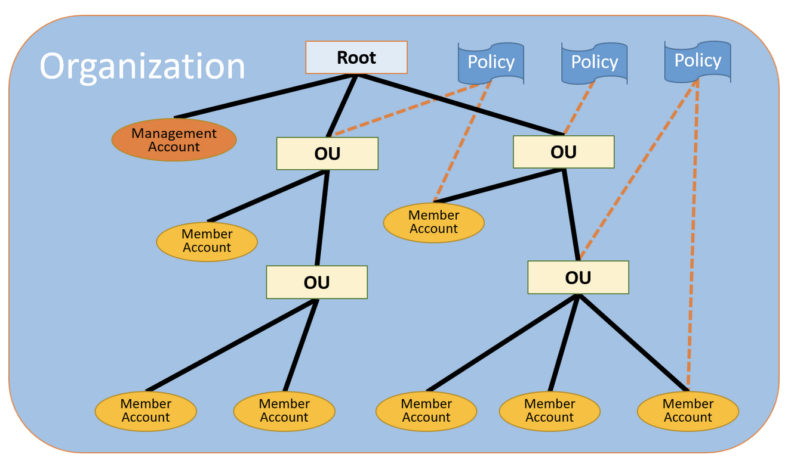
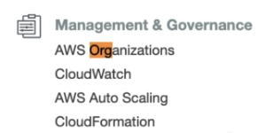

# AWS Associate Architect traning notes

Notes and cheat sheets made while reading [this udemy training](https://www.udemy.com/course/aws-certified-solutions-architect-associate) preparing for the AWS Associate Architect Certification exam.
**RECOMMANDATION**: you should read AWS FAQ for RDS, VPC, EC2, NACLS vs. Security Groups, etc. 

MISSING PART ABOUT REGIONS/AVAILABILITY ZONE

## IAM (Identity and Access Management)

When you create an account on AWS, it's a **root account**. The **root account** is a super admin account, it have all right on everything.

So you need to enable **MFA** (multi-factor auth), for instance by installing Google Authenticator on your phone. Make sure you have a **backup** for your **MFA**, because if you don't, when you lose your phone, you lose your account, forever.

This root account can create other account with restricted access. These accounts can login through a special url, something like https://myalias.signin.aws.amazon.com/console

AWS has a very powerfull access control system.
You need to understand four concept : **users**, **groups**, **roles** et **policies**

- **Policies**: are just permissions basically. AWS has a long list of are-made policies like **AdministratorAccess** which give you all right on everything, or **AmazonS3ReadOnlyAccess**. But you can also make your own **policies**. For instance, **AmazonS3ReadOnlyAccess** allow you to access all S3 buckets. But might want create a policy to access only one specific S3 bucket.
  Here is the structure of a policy (**AdministratorAccess**):

  ```json
  {
    "Version": "2012-10-17",
    "Statement": [
      {
        "Effect": "Allow",
        "Action": "*",
        "Resource": "*"
      }
    ]
  }
  ```

  So policies are a list of "Allow" or "Forbid" to do "action" on "ressource".

- **Roles**: are sets of policies. You can assign a role to an user, **but also, to an AWS ressource, like a EC2 instance**. You can for instance create a role so that myEc2Instance, and only myEc2Instance can access myS3Bucket.
  From AWS IAM FAQ:

  > **Q: How do I assume an IAM role?**
  > You assume an IAM role by calling the AWS Security Token Service (STS) AssumeRole APIs (in other words, AssumeRole, AssumeRoleWithWebIdentity, and AssumeRoleWithSAML). These APIs return a set of temporary security credentials that applications can then use to sign requests to AWS service APIs.

- **Groups**: they contain users. You can assign them policies directly, and every user in the group will have these permissions.

- **Users**: an account created by the root account. You can put the user in a group, or directly assign policies to the user. **They have no permissions when first created**

When you create an user, if you check "programmatic access", it will generate an **access Id** and a **secret key**. YOU NEED TO SAVE THE SECRET KEY RIGHT AWAY, OR IT WILL BE LOST FOREVER.

Five things you can after creating your root account, in IAM:

- Create an alias for the signin url. By default it's something like (https://123456789012.signin.aws.amazon.com/console), you can make it easier to remember (like https://myalias.signin.aws.amazon.com/console)
- Enable MFA for the root account
- Create at least one user and avoid using the root account
- Create at least a group
- Create a IAM password poilcy (how often should user change their password, minimum length, etc...)

**RECOMMANDATION**: use your root account as little as possible. Create a admin IAM user and use it instead.

## Using AWS CLI

On macos, you can install aws cli with homebrew

```bash
brew install awscli
```

If you are using **zsh** and **oh-my-zsh** you can get autocompletion for the aws cli by enabling the aws plugin in your .zshrc file:

```bash
plugins=(git ... aws)
```

Then you can login to your aws account using:

```bash
aws configure
AWS Access Key ID [None]: XXXXXXXXXXXXXXXXXXXX
AWS Secret Access Key [None]: XXXXXXXXXXXXXXXXXXXXXXXXXXXXXXXXXXXXXXXX
Default region name [None]: eu-west-3
Default output format [None]: json
```

Then you can use aws cli to query IAM groups for instance:

```bash
aws iam list-groups
{
    "Groups": [
        {
            "Path": "/",
            "GroupName": "Developpers",
            "GroupId": "XXXXXXXXXXXXXXXXXXXX",
            "Arn": "arn:aws:iam::333333333333:group/Developpers",
            "CreateDate": "2021-03-19T18:52:43+00:00"
        }
    ]
}
```


## Set an billing alarm with cloudwatch

You can create a billing almart so that you receive an email as soon as your monthly bill go beyond a certain amount. It's really helpfull if you forgot you had that expensive EC2 instance running, or if you underestimated the pricing of an AWS service.

For that search for **cloudwatch**, then in the left menu **alarms > billing** and then **create alarm**. Enter an amount at the bottom of  the page, check "create new topic (SNS)" in the next page, enter your email, on the next page enter name and description, then on the last page click create alarm and you're good. The alarm my be in "**insufficient data**" category. If you just created your account and are in free tier, **that's normal.**

You can create folders in your S3 bucket.

## S3 - Simple Storage Service

**S3 IS A BIG PART OF THE EXAM**
S3 allow you to store an unlimited number of files. You can create:

- A **bucket** : it's basically a folder.
  The **name** of your **bucket** must be **unique globally**, because it will be in the url of your bucket: https://mybucket.eu-west-3.amazonaws.com/.
- An **object**: it's just a file.
  **Key** is the name of the file, **value** is the content. You also have a **versionId**, (you can have multiple versions of one file). You can also store **metadata** with the file. You also have **subresources** attached to the file, like access control lists and torrent. The file can be 0 bytes up to 5TB. It's always inside a bucket.

If you have the right permission, you can upload a file with HTTP PUT and it will return **status 200**.

**Data consistency**: 

- **Read after write consistency for PUT**: when you put a new object in a bucket, you can read it immediatly
- **Eventual consistency for DELETE and overwrite**: If you overwrite or delete an object, it might take a while before it takes effect (you might read the previous version for a little while).

**Availability**: S3 aim for **99.99%** availability and amazon **guarantee 99.9% availability** and guarantee 99.99999999999% (99. 11 x 9) **durability** (basicaly the file will never be lost or corrupted).


- **Lifecycle management**: you can automaticaly move files when they are X days old.
- **Versionning**: You can have multiple version of the same file
- **Encryption**: you can encrypte the files

- **Tiered storage**: S3 has various Storage tier, with various pricing and use cases.
- **You can enable mandatory MFA for file delete** (important for the exam)
- Control S3 access using **Access Control Lists** and **Bucket Policies**

### S3 tiers

- **S3 standard**: 99.99% availability + 9.11x9% durability. Stored redundantly in multiple facilities (can sustain the loss of 2 at the same time). The most expensive option
- **S3 IA - Infrequent Accessed**: cheaper than S3 standard, instant access, but charge retriaval fee
- **S3 One zone IA**: same thing but even cheaper. It's only in one Availability zone so the availability is lower.
- **S3 - intelligent tiering**: Move files to the most appropriate tier automatically, without performance impact or operational overhead.
- **S3 glacier**: durable, for data archiving, every reliable, and very cheap. Take minutes to hours to retrieve data
- **S3 glacier deep archive**: Even cheaper, around 1$ per TB. Can take 12 hours to retrieve data.


You are charged depending how:

- How much data you store
- How many request (reads/writes) you make
- The tier you are using for storage
- How much data is transfered
- Transfer acceleration
- Cross region replication pricing

**Transfer acceleration**: Ideal for uploads on long distance. When an user from Japan upload a file, instead of sending it directly to your S3 bucket in France, the file will be uploaded to a edge server close to the user. Then the file will be transfered from the edge server to your bucket. This is faster because the connection between aws edge server and the S3 bucket is super fast.

**BEFORE EXAM READ S3 FAQs. IT COMES UP A LOT.**

Three ways to restrict access:

- Bucket policies
- Object policies
- IAM policies to User & groups


### Encryption

- Encryption in transit = HTTPS (SSL/TLS)
- Encryption at rest (server side)
  - S3 Manager Keys - **SSE-S3** (amazon manage the keys for you)
  - AWS Key Management Service, Managed keys : **SSE-KMS**
  - Server side encryption with customer provided keys - SSE-C
- Client side encryption

### Versionning

If you enable versionning, make the first version of a file public and then upload a new version of that file, the new version WILL NOT be public. You have to make every version public.

When you delete a document, when versionning is enabled, you don't delete the versionned objects. It just has a **"delete" marker**, you cannot access it through the url, and you don't see the file listed in the bucket, unless you enable "list version". But the data is still here. You can restore deleted versionned objects.

When you disable versionning in a bucket, it will not create new versions for objects, but it won't delete existing versions of objects.

You can permanently delete versions. You can enable **MFA for delete**

### Lifecycle actions

You can :

- Transfer current version to other Storage Tier after X days
- Transfer non-current version to other Storage Tier after Y days
- Delete permanently previous object version after X days

### S3 Object Lock and Glacier Vault Lock

S3 lock can be applied to individual Object or to the whole bucket

Write once, read many (WORM) : you can prevent objects to be deleted or modified for a period of time or indefinitely

**Governance mode**: WORM for most users but exception if you have special persmission

**Compliance mode**: no one can delete or overwrite, including root user

**Rentention period:** The period of time during which the object is protected

The retention period is stored in object metadata.

**Legal hold**: WORM with no rentention period. In effect until removed.

**Glacier Vault Lock**: similar to S3 Object lock. You create a Vault lock policy and then you can lock that policy: you can't change to policy after that.


### S3 performance

First bytes after 100 to 200ms

**prefix**: mybucketname/folder1/subfolder1/myfile.jpg > /folder1/subfolder1

Important because max **5500 GET** request/s and **3500 PUT/COPY/POST/DELETE** **per prefix**

All files in 1 prefix => you can serve at most 5500 files per second.
Files split into 2 prefixes => you can serve 11 000 files per second.
                         4 prefixes => you can serve 22 000 files per second.

**You should split your files in different prefixes**

**Performance limitations with S3 SSE-KMS**: limit number of read/write **per Region** (**5500, 10 000 or 30 000** depending on region). You cannot request quota increase.

**Multipart upload**: recommanded for files over 100MB, required for over 5G. Parallelize uploads (**increase efficiency**). The file is split 

**S3 Byte-Range Fetches**: same thing but for download. (Split big file in small part, and download parts in parallel). Can be used to read file header only too.


### S3 Select and Glacier select

**S3 Select**: you can extract data from an S3 Object using an SQL expressions.
You get data by rows or coulons. Save money, increase speed.

For example, If you have a gzipped CSV file on S3 and want to retrieve a single line, instead of downloading, unzipping and parsing the whole file, you can use **S3 Select** to get only the data you need with an **SQL request**.

**Glacier Select:** similar to S3 select

### Cross account S3 buckets access

You can access s3 buckets from another AWS account (*I mean **another root account NOT another IAM user***) using **AWS organizations**.

**POPULAR AND IMPORTANT EXAM TOPIC **(need to know the three way you can do this)



**AWS Organization**: A way to connect and organize several **root accounts** (not IAM users). You have a **master account**, which can be used to restrict other child root accounts. You can recreate your company structure with AWS accounts. You can create a hierachy using OUs (Organization Units). You can apply a policy to it. All the children accounts and children OU will follow this policy (the effect is recursive).

**Consolidated billing**: Aws the more you use, the less you Pay, so if you use the Organization's **master account** for billing, you pay less. **You get volume pricing discount** + it's easier to keep track of the costs. Consolidated billing = one bill per AWS account.

To create an organization you go to **AWS Organizations** in  **Management & Governance**



Then you create an organization and you invite other accounts to join.

In the master account, you can have a tree view of your organization.

You can then apply **Service Control Policies** to OU and accounts: You can for instance disable everything but S3 for an account or OU.

**WHY USE AWS ORGANIZATIONS INSTEAD OF IAM USERS AND GROUPS ?**

- You can be a company with several unrelated projects and you want to isolate their AWS resources (for security and organization reason) but still want to benefit from volume pricing discount.
- You might want to seperate you dev/staging and production environnement so that your new intern doesn't screw your production env. That's the most typical use case.
- You might have several teams in your organization and you don't want them to use the same root account.

**RECOMMANDATIONS**:

- Enable MFA for all root accounts and set a strong password
- Do not deploy resources in the billing account
- Use Service Control Policies to disable unused services (maybe you don't want the finance team to be able to run EC2 instances)

### 3 ways to share buckets

- **Bucket policies** and IAM (for programmatic access only)
- **Bucket ACLs** (access control list) & IAM for individual objects (for programmatic access only)
- **Cross-accounts IAM roles**. Programmatic AND Console access

#### Cross-accounts IAM roles

You **create a role** (like CrossAccountS3AccessRole) in your **master account** and you set another account of your organization as the **trusted entity**. You give that role the S3 full access permissions. **This process will generate a link to switch role, you will need it.**

Then **in your other account** you create a IAM user, and login as that user. You **paste the link** mentioned above, and click "switch role". Then you have only have the permissions to use the S3 service.

### Cross region replication

If your app is international, and you have a bucket in France, your users in Japan will have harder time to access the file (slow transfer (unless transfer acceleration enabled) and latency). So you might want to copy all the files in your bucket in France to a bucket in Japan automatically and keep them in sync.

For that you need to create a bucket in Tokyo, then in your original bucket in France, you need to configure **Replication rules** in **Management**. You give it a name and chose your Japan bucket as a target. You must select a role. **You can choose to apply this to only a spefic prefix** (folder). Your target bucket can be in another account. You can also change the Storage class (tier) while transfering files. You can enable Replication Time Control (RTC) which guarantee that 99.99% of your objects will be replicated under 15minutes. You can explore the different options in the console, it's pretty clear.

**You need to enable versionning in your source and destination buckets for replication to work**

⚠️ THE REPLICATION RULE ONLY COPY OBJECTS AND VERSIONS ADDED **AFTER** YOU CREATED THE RULE.
⚠️ **IT ALSO DOES NOT REPLICATE PERMISSIONS (ACL)**
⚠️ **DELETING VERSIONS AND DELETE MARKERS WILL NOT BE REPLICATED**

### Transfer Acceleration

Your users upload files to an edge location instead of the S3 bucket directly. The edge location is used as a kind of proxy. Connection between user and edge location is good because close. The connection between the edge location and the S3 bucket is VERY GOOD because it uses AWS internal and highly optimised network (**backbone network**). This is much more efficient than upload the file directly to the bucket if your user is far from it.

If you use it keep in mind that you pay an extra:

> S3 Transfer Acceleration pricing is in addition to Data Transfer pricing.
>
> Accelerated by AWS Edge Locations in the United States, Europe, and Japan 	$0.04 per GB

You can use this tool to get an idea of the speed improvement:
[accelerate speed comparison](https://s3-accelerate-speedtest.s3-accelerate.amazonaws.com/en/accelerate-speed-comparsion.html)

Can be slower sometimes (for instance France to Europe or US East to France), but France to Tokyo is 30% faster for me.

### AWS DataSync

Allow you to transfer large amounts of data to/from your AWS S3 bucket from outside AWS (like on-premise).

- Used to move large amounts of data (from on-premise for instance)
- Used with NFS and SMB 
- Replication can be done every hour, day or week
- You need to install a DataSync agent
- Can be used to replicate **EFS to EFS** (Elastic File System)

> Amazon EFS is designed to provide massively parallel shared access to thousands of [Amazon EC2](https://aws.amazon.com/ec2/) instances, and AWS containers and serverless compute services including [Amazon Elastic Container Service](https://aws.amazon.com/ecs/) (ECS), [Amazon Elastic Kubernetes Service](https://aws.amazon.com/eks/) (EKS), [AWS Fargate](https://aws.amazon.com/fargate/), and [AWS Lambda](https://aws.amazon.com/lambda/), enabling your applications to achieve high levels of aggregate throughput and IOPS with consistent low latencies.

### CloudFront

Cloudfront is a **CDN** (Cloud Delivery Network), hundreds of servers across the world that store cached versions of pages/files from the **Origin** server (S3 bucket, EC2 instance, etc...), in order to speed up page load, file transfer. These servers are the **Edge Locations**. This set of Edge Locations, the CDN, is called **Distribution**.

Edge location can be used as proxy (like we saw in transfer acceleration), so it can be used to **serve** static files, but also for **dynamic content and streaming !**

**Two types of distribution**:

- Web distribution, for websites
- RTMP - used for Media Streaming

**Edge locations are NOT read only. You can write to them too.**

Object cached for the TTL (Time To Live). You can clear cache manually or programmatically, but you will be charged for that. This is not free ! You are charged a fee.

It take time to create or delete a cloudfront distribution (like 30min - 1hour)

You can invalidate object with invalidation path. like `/images/*`

you can enable: force use of signed urls/cookies

#### Signed Urls vs signed cookies

**Signed url**: url containing authorisation/access control metadata, signed digitale. You can generate urls with an expiration date for instance. Perfect to restrict access to one specific file.

**Signed cookies**: Same thing but in a cookies. If you want to restrict access to several files.

When we create a signe dUrl or signed cookie, we attach a policy, which can include:

- URL expiration
- IP ranges
- Trusted signers (which Aws accounts can create signed URLS).

**OAI**: **Origin Access Identity**

You generate signed url/cookies using AWS SDK

**S3 signed URLs** different from cloudfront signed URL. URL signed as **IAM user**. Limited lifetime.

EC2 origin => cloudfront sign url

S3 bucket file => maybe S3 signed url

### Snowball


**Snowball** is ... **a suitcase**. Yeah really. A suitcase containing disks full of data. You have a 50TB version and 80TB. It can be used to transfer petabytes of data. The data is encrypted with 256-bit encryption. Can be a fith of high-speed internet data transfer costs.

**AWS Snowball Edge**: 100TB data per snowball edge. Storage and **compute capabilities**. Perfect for remote or offline locations. (Example: in aircraft tests). It can run lambda functions. You can create clusters using this.

**AWS Snowmobile:** It's a freaking shipping container pulled by a truck. 100PB per snowmobile. For Exabyte-scale data transfer. I don't think I'm ever going to need this one...

**You can use all this to Import/export to S3.**

### Storage Gateway

Connect on-premise network with AWS cloud. It a safe way to extend your on-premise data center with S3 storage capabilities.

The AWS Storage Gateway's software appliance is a WM you setup in your data center and use as a Gateway for data transfer to AWS. You then need to use AWS console to configure it.

**File Gateway:** to store files in S3.

**Volume Gateway**: a copy of a volume (disk) in one big shunt

NOT really interested by this so I will come back to this if I really want to take the exam.

### Anthena and Macie

**Anthena**: Analyse and query data stored on S3 with SQL. No need to Extract/Transform/Load. It's **serverless**. Interactive query service. Mostly used to analyse logs.

Can be used to query logs. Can generate buisness report, by querying billing data. Can run queries on click-stream data.

**PII**: Personnally Identifiable Information. Critical information: Identity card, credit card number, etc...

**Macie**: A security service which automatically detect PII and other sensitive data stored on your S3 bucket, can give you alerts and stuff. It uses AI. Includes dashboards, reports, alerting. Great for PCI-CSS compliance and preventing ID theft. Can be used to detect suspicious activity together with CloudTrail logs.

