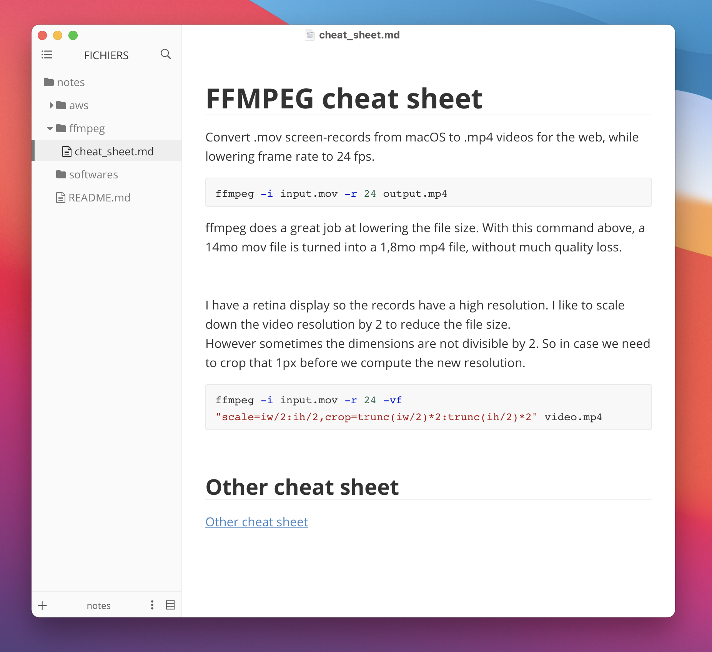

# Software

A list of the software and platforms I use and like. Well I'm not going to talk about the obvious one like VS Code or Firefox. Rather I focus on those that are less well-known.

## Typora

[Typora](https://typora.io/) is a **WYSIWYG markdown editor**. It's based on **Electron** so it's cross platform.
You can just type markdown like in a normal text editor and Typora makes it look great.

I like the **minimalist** interface and how **fast** it feels. You can insert the screenshots you just made effortlessly: Typora insert it in the text and asks you where you want to save it. You can also use the usual rich-text editor shortcuts, like **cmd + b** for bold. You also get a bunch of **themes** and you can write your own in CSS (and yes there is a **dark mode**).

Basicaly with Typora you get the nice and intuitive experience of Word with human readable, versionnable markdown text files.

Oh, also : it's **free**.

